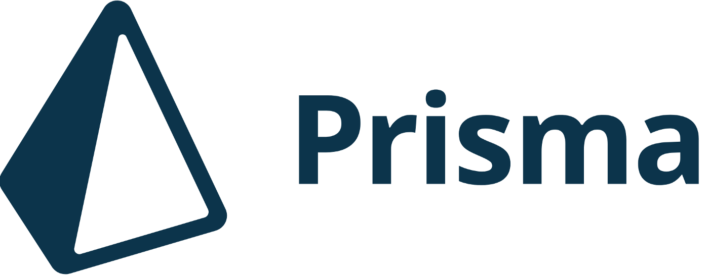

<!-- markdownlint-disable MD010 -->
<!-- markdownlint-disable MD033 -->
<!-- markdownlint-disable MD041 -->

<div align="center">
   
   
</div>
<br>

<div align="center">
   <a href="https://github.com/mgckaled">
      
   </a>
   
   
   <a href="https://github.com/mgckaled/ignite-nodejs_prisma/commits/main">
      
   </a>
   
</div>
<br>

<div align="center">
  <a>
    
    
  <a/>
</div>

<br>

# Ignite Node.js - Prisma

<div align="center">

[**Sobre o Projeto**](#sobre-o-projeto) &nbsp;&nbsp;**•**&nbsp;&nbsp;
[**Configurações**](#configurações) &nbsp;&nbsp;**•**&nbsp;&nbsp;
[**Licença**](#licença)

</div>

## Sobre o Projeto

Nesse módulo, iremos conhecer o Prisma IO, que é um framework ORM. Ao longo desta unidade de estudo, iremos aprender os fundamentos do Prisma, como ele funciona, como podemos utilizar ele em uma aplicação NodeJS e os benefícios que essa poderosa ferramenta tem para otimizar nosso trabalho e melhorar a performance da nossa aplicação.

## Configurações

```bash
# instalar dependências:
$ yarn
# executar arquivo ts
$ yarn ts-node-dev <src>/<file>.ts
```

Comandos Prisma:

```bash
# mostrar versão
$ yarn prisma -v
# iniciar prisma com sqlite
$ yarn prisma init --datasource-provider sqlite
# Validar arquivo schema.prisma
$ yarn prisma validate
# executar prisma studio
$ yarn prisma studio
# migração
$ yarn prisma migrate dev
# mostrar status das migrações
$ yarn prisma migrate status
```

## Licença

Distribuído sob a licença _MIT_. Veja [LICENSE](LICENSE) para mais informações.

---

<h5 align="center">
  &copy;2022 - <a href="https://github.com/mgckaled/">Marcel Kaled</a>
</h5>
